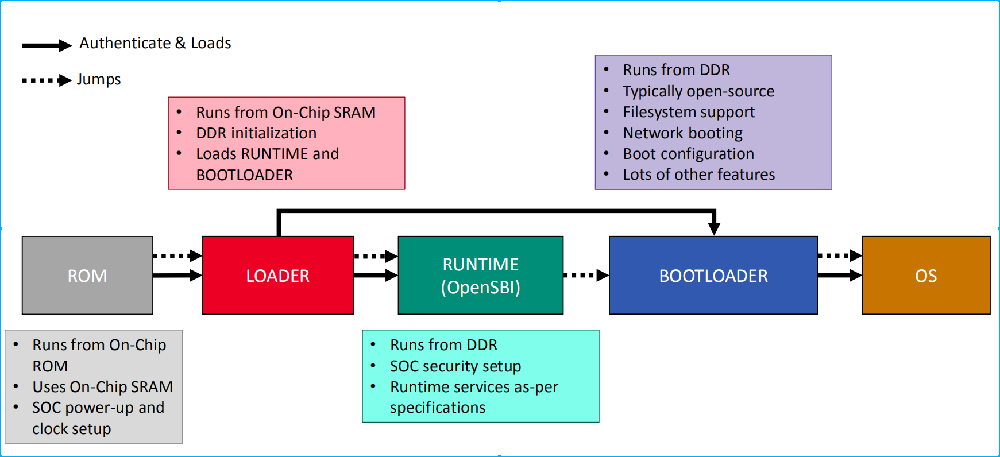

# 基础知识
1. MROM	Mask ROM (掩模只读存储器)。
   1. 只读，出厂时固化，掉电不丢失，无法修改。	
   2. 它负责加载第一级启动固件（即您写的 lowlevelboot），并将CPU引导至后续执行阶段。在您的QEMU仿真中，startup.s 代码就是从MROM（映射到地址0）开始执行的。
2. PFlash Parallel Flash (并行闪存)	
   1. 可读可写，掉电不丢失，擦除/写入速度较慢，按块操作。	
   2. 用于存储持久化固件或稍大容量的启动代码。您的 fw.bin 就是作为PFlash镜像挂载到地址 0x20000000。它相当于开发板上的SPI Flash或Nor Flash。
3. SRAM	Static RAM (静态随机存取存储器)	
   1. 可读可写，速度极快，但掉电丢失，容量小，成本高。	
   2. 通常用作CPU的高速缓存 (Cache) 或片上紧耦合内存 (TCM)，用于存放关键变量、堆栈或在初始化DDR之前运行的关键代码。
4. DRAM	Dynamic RAM (动态随机存取存储器)
   1. 	可读可写，容量大，速度较快，但掉电丢失，需要定期刷新。	
   2. 即DDR内存，是系统的主要内存。在操作系统或大型程序运行时，代码和数据主要存放在这里。您的QEMU启动参数 -m 1G 分配的就是DRAM。

## RISC-V 多级启动流程表

| 启动阶段 | 常见名称 | 运行特权级 | 核心职责 | 典型实现 |
| :--- | :--- | :--- | :--- | :--- |
| **BL0** | MROM (Boot ROM) | **M模式** | 硬件信任根。芯片出厂固化的不可变代码，负责系统复位和最基本的引导，通常负责加载并验证BL1。 | 芯片内部固化的ROM代码 |
| **BL1** | 低阶启动代码 / 固件加载器 | **M模式** | 基础硬件初始化。负责初始化CPU核心、高速缓存、堆栈，以及最关键的系统内存（DDR控制器初始化），为运行更复杂的程序准备环境。 | 您编写的 `lowlevelboot` (或 U-Boot SPL) |
| **BL2** | 平台固件 / 运行时服务层 | **M模式** | 提供标准化底层服务。运行在M模式，实现并暴露RISC-V SBI规范接口，为S模式的软件提供硬件无关的服务调用。它不负责初始化DDR或加载内核。 | **OpenSBI** |
| **BL3** | 引导加载程序 / 操作系统 | **S模式** (或HS模式) | 加载并运行操作系统。负责从存储介质（如Flash、SD卡）读取Linux内核镜像和设备树，将其加载到内存并跳转执行。也可提供丰富的命令行调试功能。 | **U-Boot** (主体)、**Linux内核** (可直接作为Payload) |
| **用户态** | 应用程序 | **U模式** | 运行用户程序。运行在最低特权级，无法直接访问硬件，通过系统调用（`ecall`）向S模式的内核请求服务。 | `bash`、`gcc` 等用户程序 |

## 设计的多级BootLoader框架


# OpenSBI 学习
SBI 是 Supervisor Execution Environment 与 Supervisor 软件之间的二进制接口规范。
当 Linux 需要执行自己权限不足以直接完成的操作时，会执行`ecall`进入OpenSBI
当前 SBI 调用约定中，通常使用：
``` shell
a7：SBI Extension ID，EID
a6：该扩展中的 Function ID，FID
a0～a5：参数
a0：返回错误码
a1：返回值

Linux 内核 S-mode
   ↓ ecall / SBI
OpenSBI M-mode
```
SBI可以提供的服务
``` shell
定时器管理
    └── 设置下一次时钟事件

核间中断
    └── 向其他 hart 发送 IPI

远程 Fence
    ├── remote fence.i
    └── remote sfence.vma

Hart 状态管理
    ├── 启动 hart
    ├── 停止 hart
    └── 查询 hart 状态

系统复位
    ├── shutdown
    └── reboot

性能监控
    └── PMU 服务

调试控制台
    └── 新版 SBI 调试控制台扩展
```

## 启动传递
```shell
# RISC-V 启动约定中，进入下一阶段时通常使用
a0 = 当前 hart ID
a1 = DTB 的物理地址

# 如BL1 跳入 OpenSBI
mv   a0, hartid
la   a1, dtb_address
jr   opensbi_entry
```
OpenSBI完成初始化后，再进入 U-Boot或 Linux，也会把对应的 hart ID 和设备树地址传下去。

## 固件镜像
OpenSBI 编译生成的三类固件镜像，其核心区别在于如何找到并执行下一阶段的启动代码
1. FW_JUMP：跳转到固定地址执行下一阶段代码。
   1. 前级Bootloader已将下一阶段代码加载到内存的已知固定地址，OpenSBI只需跳转过去。
2. FW_DYNAMIC：从上一级启动阶段动态获取下一阶段入口地址等信息。	
   1. 前级Bootloader能力较强，能动态传递入口地址和相关信息，灵活性最高。
3. FW_PAYLOAD：将下一阶段代码（如U-Boot）直接打包在OpenSBI固件内部。	
   1. 前级Bootloader能力弱，无法分别加载OpenSBI和下一阶段代码；或前级不传递设备树(FDT)时，可通过此方式将FDT一并嵌入
### FW_JUMP
`opensbi-0.9/firmware/fw_base.ldS`义了fw_jump固件的链接脚本
FW_TEXT_START定义了固件运行的的起始地址，然后依次放置text段，rodata段，data段，bss段，bss段后将被用作栈空间，
注意就是data没有LMA，也就是说opensbi要运行在ddr内而不能在flash内xip运行
`opensbi-0.9/firmware/fw_base.S`是opensbi的启动文件